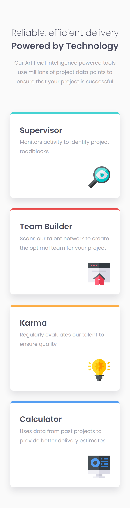
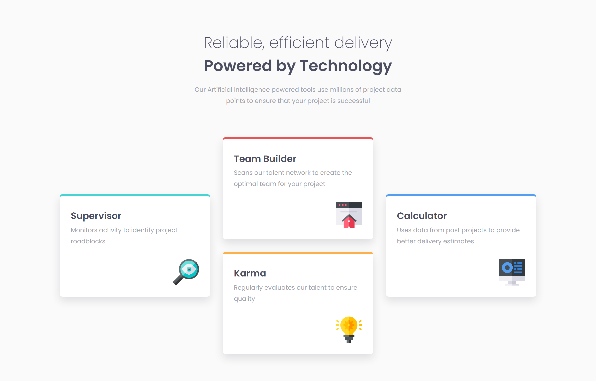

# Frontend Mentor - Four card feature section solution

This is a solution to the [Four card feature section challenge on Frontend Mentor](https://www.frontendmentor.io/challenges/four-card-feature-section-weK1eFYK). Frontend Mentor challenges help you improve your coding skills by building realistic projects. 

## Table of contents

- [Overview](#overview)
  - [The challenge](#the-challenge)
  - [Screenshot](#screenshot)
  - [Links](#links)
- [My process](#my-process)
  - [Built with](#built-with)
  - [Useful resources](#useful-resources)
- [Author](#author)

## Overview

This is the second challenge in the **Building Responsive Layouts Frontend Mentor Roadmap**.

It was a fun challenge with a funky layout on desktop. I used one media query and tried to get the design optimal on most known devices.

### The challenge

Users should be able to:

- View the optimal layout for the site depending on their device's screen size

### Screenshot

#### Mobile

#### Desktop

### Links

- Solution URL: [Solution URL](https://www.frontendmentor.io/solutions/responsive-four-card-feature-section-DGOcwT90DL)
- Live Site URL: [Live Site URL](https://frontendmentor-ilyesab.github.io/four-card-feature-section/)

## My process

### Built with

- Semantic HTML5 markup
- CSS custom properties
- Flexbox
- CSS Grid
- Mobile-first workflow

### Useful resources

- [Josh Comeau CSS Reset](https://www.joshwcomeau.com/css/custom-css-reset/) - I used Josh Comeau CSS Reset to make styling for this project much easier. He has a great blog. I highly recommend checking out his content.

## Author

- Frontend Mentor - [@ilyesab](https://www.frontendmentor.io/profile/ilyesab)

